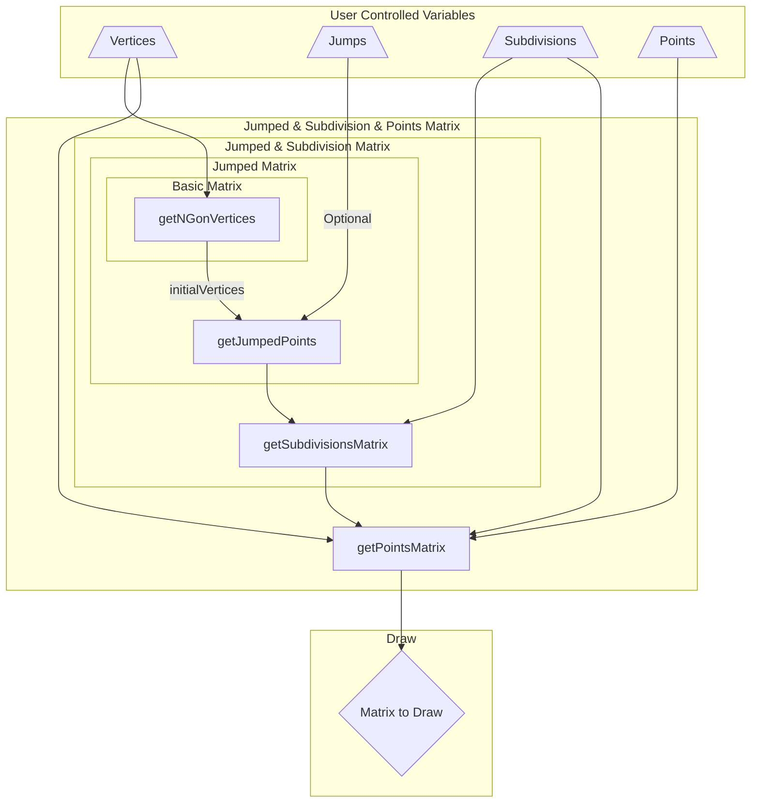
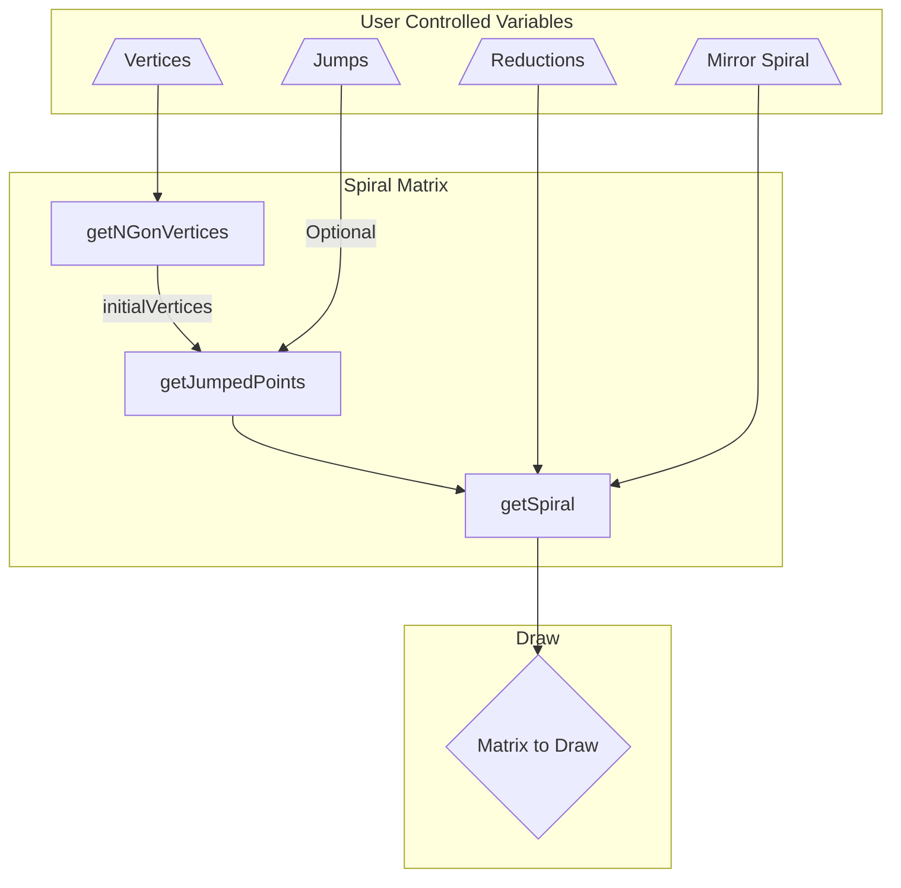

# Playing With Polygons (PWP)

A project created for the fun of creating cool patterns with maths 🔢

## Sequences to create different variation's

### Default N-Gon Shape

```mermaid
graph TD
  subgraph User Controlled Variables
  V[/Vertices\]
  J[/Jumps\]
  S[/Subdivisions\]
  P[/Points\]
  end
  subgraph Jumped & Subdivision & Points Matrix
  subgraph Jumped & Subdivision Matrix
  subgraph Jumped Matrix
  subgraph Basic Matrix
  V --> N
  end
  N[getNGonVertices] -->|initialVertices| JP[getJumpedPoints]
  J -->|Optional| JP
  end
  S ---> SM
  JP --> SM[getSubdivisionsMatrix]
  end
  SM --> PM[getPointsMatrix]
  V --> PM
  P --> PM
  S --> PM
  end
  subgraph Draw
  PM --> D{Matrix to Draw}
  end
```

### Spiral N-Gon Shape

```mermaid
graph TD
  subgraph User Controlled Variables
  V[/Vertices\]
  J[/Jumps\]
  R[/Reductions\]
  M[/Mirror Spiral\]
  end
  subgraph SM [Spiral Matrix]
  V --> N
  N[getNGonVertices] -->|initialVertices| JP[getJumpedPoints]
  J -->|Optional| JP
  JP --> S[getSpiral]
  R --> S
  M --> S
  end
  subgraph Draw
  S --> D{Matrix to Draw}
  end
```
