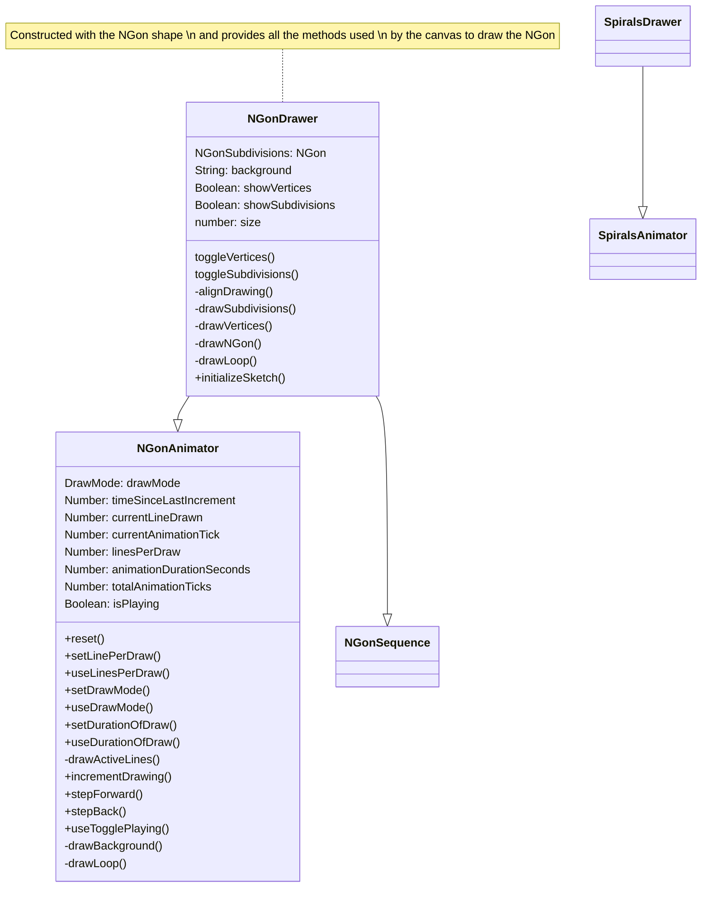
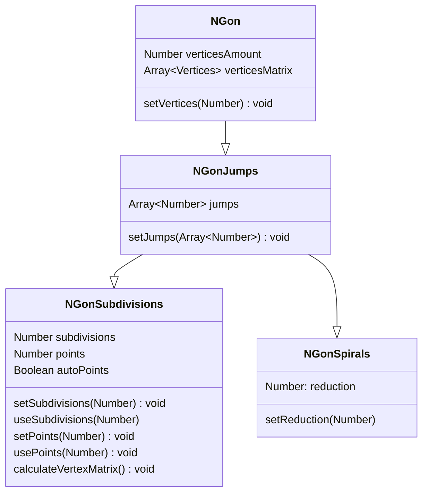
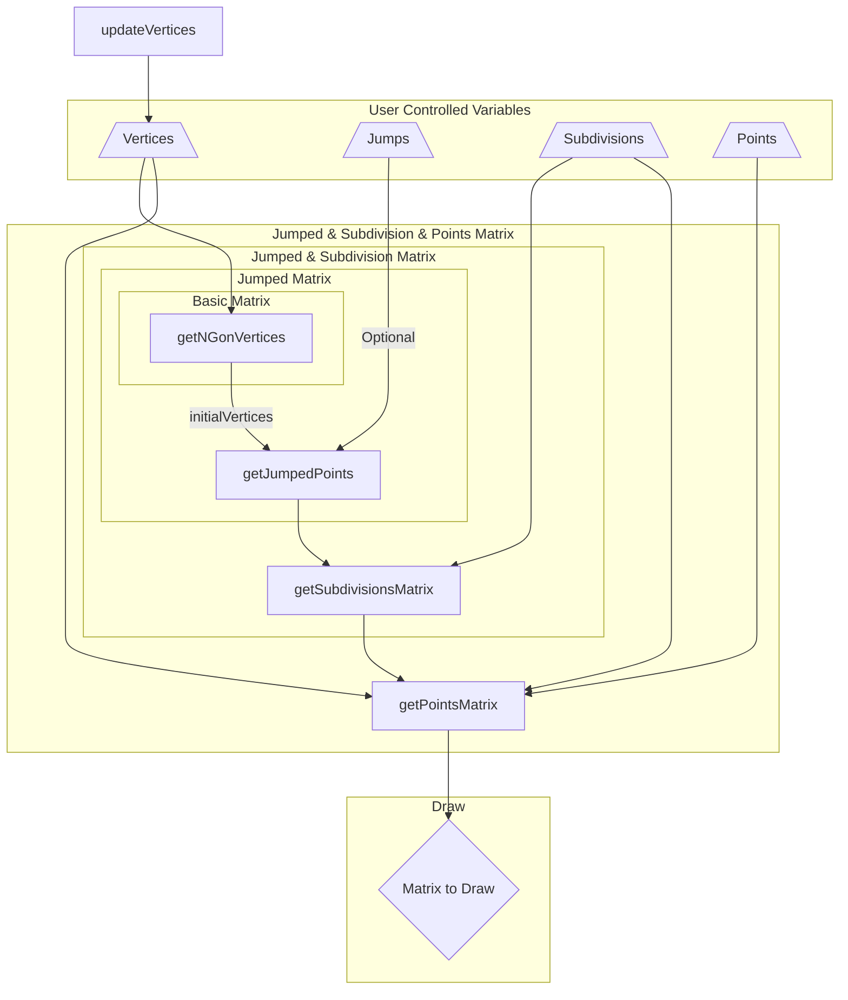
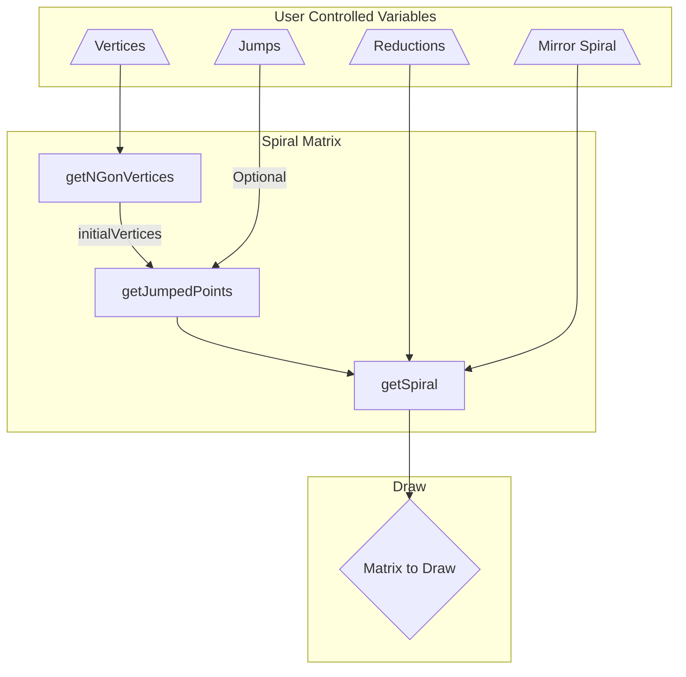

# Playing With Polygons (PWP)

A project created for the fun of creating cool patterns with maths 🔢

## Class Diagrams

## Sequences to create different variations

### Get Shape Classes

### Default N-Gon Shape

### Spiral N-Gon Shape

